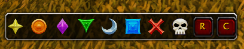

# Easy marks
Simple WoW addon for fast target marking

## Description
Addon adds panel with all raid icons so you can easy access them during your raid or dungeon walkthrough.

### Panel structure
- The first 8 buttons are raid target icons, clicking them will set raid target on selected unit.
- The ninth button is `Remove` button, clicking it will remove raid target icon from _current_ target.
- The tenth button is `Clear` button, clicking it will _clear all_ raid target icons.
## TODO
1. Add panel resizing
2. Add panel disabling
3. Add `Remove` and `Clear` buttons textures
4. Add button factory
